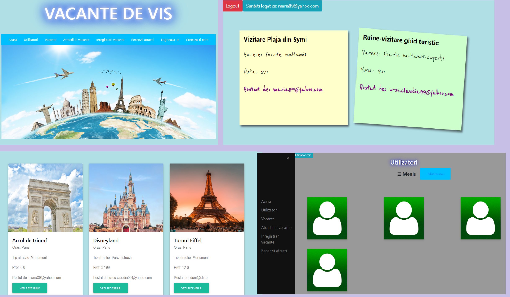

# Travel Web Application
#### This is a web application created with a colleague, and this is our final project for Advanced Elements of Programming course.
The backend is made in Java and Spring (Spring Boot and Spring Security), and the frontend is made in HTML, CSS and Javascript.
The user can create an account, login, logout, add new travels and attractions, add photos or reviews to existing travelling destinations. He can also view others' posts but he can edit only his posts.

#### Screenshots with the some of the pages: 

